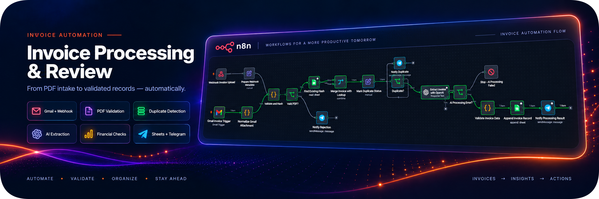
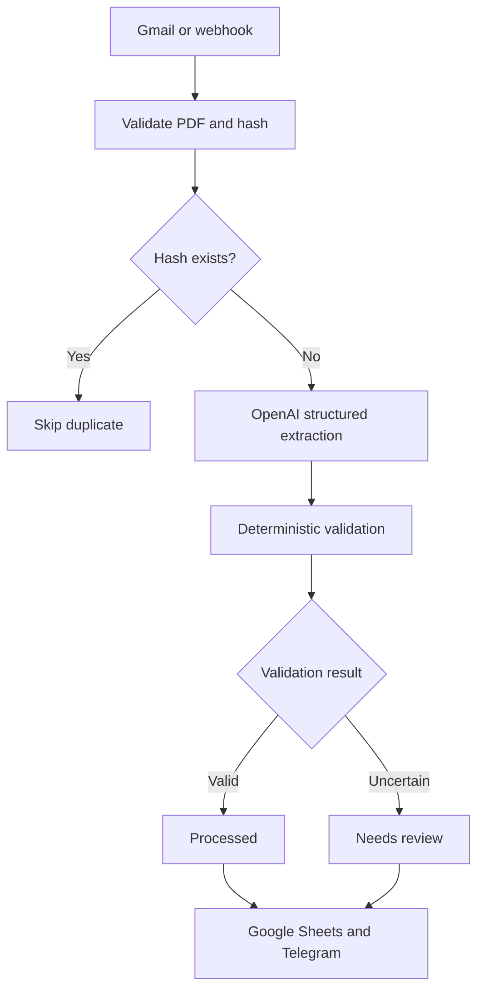
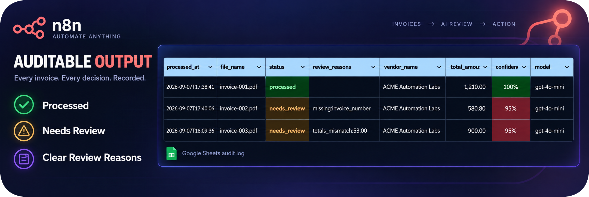
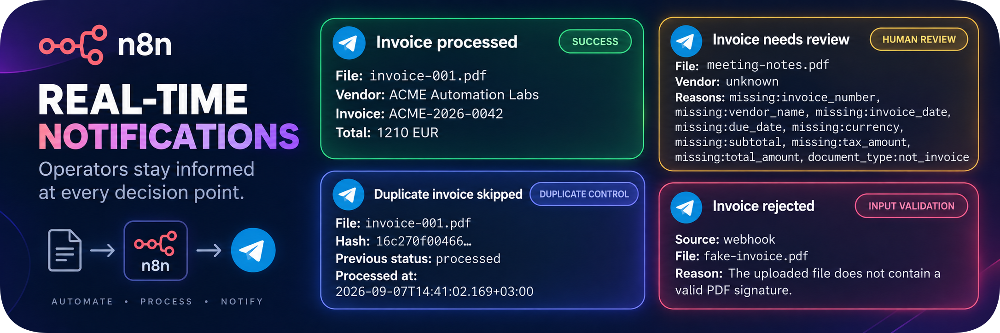

# Invoice Processing & Review Workflow

Production-minded n8n workflow for invoice intake, AI-powered structured extraction, deterministic validation, duplicate detection, Google Sheets storage, and human review routing.

> Portfolio-grade MVP: intentionally small, reproducible, and explicit about its limitations.



## Business Problem

Teams often receive invoices by email and manually copy dates, vendor details, and totals into a spreadsheet. Manual intake is slow, duplicate-prone, and offers no consistent way to separate trustworthy extractions from documents that need review.

## Solution

This repository provides two importable n8n workflows:

- a main workflow that accepts one PDF from Gmail or an authenticated webhook;
- an error workflow that reports unexpected failures to Telegram.

The main workflow validates the file, calculates a SHA-256 hash, checks for an existing record, sends new PDFs to the OpenAI Responses API, validates the extracted values, writes a record to Google Sheets, and notifies an operator.

The LLM extracts fields but does **not** make the final processing decision. Deterministic code checks missing fields, dates, currencies, non-negative amounts, confidence, and whether subtotal plus tax matches the printed total.

## Architecture



Unexpected failures are caught by the companion Error Trigger workflow and sent to Telegram with safe execution metadata.

## Key Features

- Gmail and authenticated webhook intake;
- Gmail intake restricted by the `invoice-intake` label;
- Gmail messages must contain exactly one PDF attachment;
- webhook processing uses one documented multipart file field named `data`;
- extension, MIME, size, and `%PDF-` signature checks before AI;
- 10 MiB application-level file limit;
- SHA-256 duplicate detection before AI processing;
- OpenAI Responses API with PDF `input_file`;
- strict JSON Schema output;
- model refusals and incomplete responses handled explicitly;
- deterministic financial validation;
- `processed`, `needs_review`, and rejected paths;
- successful duplicate suppression;
- direct PDF input through the native n8n OpenAI node with `store: false`;
- Google Sheets audit record;
- Telegram success, review, duplicate, rejection, and failure notifications;
- targeted retries on OpenAI extraction, Google Sheets append, the final result notification, and the error alert;
- synthetic test documents only.

## Repository Structure

```text
.
├── .github/workflows/validate.yml
├── .env.example
├── demo/
│   ├── google-sheets-template.csv
│   ├── invoices/
│   │   ├── invoice-001.pdf
│   │   ├── invoice-002.pdf
│   │   └── invoice-003.pdf
│   └── not-an-invoice.txt
├── docs/
│   ├── setup.md
│   ├── test-cases.md
│   └── threat-model.md
├── schemas/invoice-extraction.schema.json
├── scripts/
│   ├── generate_demo_invoices.py
│   └── validate_artifacts.py
├── workflows/
│   ├── invoice-processing-error.json
│   └── invoice-processing-main.json
├── CHANGELOG.md
├── CONTRIBUTING.md
├── LICENSE
├── README.md
├── requirements-dev.txt
└── SECURITY.md
```

## Requirements

- n8n Cloud or self-hosted n8n with the node versions available in a current 2026 release;
- Gmail account for the email trigger (optional if using webhook only);
- OpenAI API credential;
- Google account with Sheets access;
- Telegram bot and private test chat;
- a Google Sheet initialized from `demo/google-sheets-template.csv`.

Python 3.13 and the packages in `requirements-dev.txt` are needed only to regenerate and validate repository artifacts locally. They are not required by n8n at runtime.

The workflow uses OpenAI's Responses API through n8n's native OpenAI node. It does not use the deprecated Assistants API or create temporary Files API uploads.

## Quick Start

1. Create a new Google Sheet.
2. Import `demo/google-sheets-template.csv` into a tab named `Invoices`.
3. Delete the example row but keep the header row unchanged.
4. Create the Gmail label and filter described in [docs/setup.md](docs/setup.md).
5. Import `workflows/invoice-processing-error.json` into n8n.
6. Import `workflows/invoice-processing-main.json` into n8n.
7. Connect credentials and reselect your Google Sheet and tab.
8. Select the imported error workflow in the main workflow settings.
9. Test with `demo/invoices/invoice-001.pdf` through the webhook.
10. Run the remaining cases from [docs/test-cases.md](docs/test-cases.md).
11. Activate Gmail intake only after the webhook tests pass.

Do not activate the main workflow before credentials, Google Sheets mappings, Telegram chat ID, Gmail routing, and the error workflow have been configured. Before publishing workflow exports, remove instance-specific workflow, credential, spreadsheet, webhook, and chat identifiers.

## Webhook Example

The Webhook node uses n8n Header Auth. Use the header name and value configured in the `Invoice Upload Header Auth` credential.

```bash
curl --request POST \
  --header "X-Invoice-Token: replace-with-your-secret" \
  --form "data=@demo/invoices/invoice-001.pdf;type=application/pdf" \
  "https://YOUR_N8N_HOST/webhook/invoice-upload"
```

Use `/webhook-test/invoice-upload` while listening for a test event in the editor, and `/webhook/invoice-upload` after the workflow is active.

The webhook responds immediately after n8n accepts the request. Processing results are delivered through Telegram and recorded in Google Sheets.

## Extracted Data Contract

The model returns:

- document type;
- invoice number;
- vendor name;
- invoice date and due date in `YYYY-MM-DD`;
- ISO 4217 currency code;
- subtotal, tax, and total;
- extraction confidence from 0 to 1;
- missing fields;
- short extraction notes.

The canonical schema is stored in [`schemas/invoice-extraction.schema.json`](schemas/invoice-extraction.schema.json) and duplicated in the native OpenAI node configuration because an imported n8n workflow cannot read a repository file at runtime.

## Validation Rules

A record is marked `needs_review` if at least one condition is true:

- a required field is missing;
- `document_type` is not `invoice`;
- model confidence is below `0.85`;
- a date does not match `YYYY-MM-DD`;
- currency is not a three-letter uppercase code;
- an amount is negative or not finite;
- `abs(subtotal + tax - total) > 0.02`.

JSON Schema compliance does not prove that extracted values are correct. This is why deterministic validation and human review remain mandatory.



## Data Retention

- The Responses API request sets `store: false`.
- The native OpenAI node sends the PDF directly as a Responses API file input.
- The workflow does not create a separate persistent Files API object, so no delete or orphan-file cleanup node is required.
- The document is still transmitted to OpenAI and remains subject to the account's current provider terms and retention controls.
- Google Sheets stores extracted invoice data and a SHA-256 hash. Access to the sheet must be restricted appropriately.

Review your organization's data-processing and retention requirements before using real invoices.

## Error Handling and Reliability

- `Extract Invoice with OpenAI` retries up to three times with a 3-second delay and then routes the regular error output to `AI Processing Error?`.
- `Append Invoice Record`, `Notify Processing Result`, and the error workflow's `Send Error Alert` retry up to three times with a 2-second delay.
- `Find Existing Hash`, `Notify Duplicate`, and `Notify Rejection` do not currently have node-level retries.
- Known input problems follow explicit rejection/review branches and do not trigger the global error workflow.
- Unexpected failures stop the execution and invoke the selected Error Workflow.
- Duplicate checking happens before the paid AI call.
- The Google Sheet header is a contract and must not be renamed silently.
- Execution data is retained in n8n for portfolio debugging; adjust retention before processing real documents.



## Testing

Install development dependencies:

```bash
python -m pip install --requirement requirements-dev.txt
```

Regenerate the synthetic PDFs:

```bash
python scripts/generate_demo_invoices.py
```

Validate workflows, schema, CSV, and generated PDFs:

```bash
python scripts/validate_artifacts.py
```

Workflow integration testing is manual because credentials and n8n executions are environment-specific. The repository supplies deterministic fixtures and expected outcomes in `docs/test-cases.md`.

## Security and Privacy

- No credential secrets or real business documents should be committed. n8n exports may still contain non-secret credential references and instance-specific resource IDs, which must be sanitized before publication.
- Webhook intake uses Header Auth.
- The webhook processes the binary field named `data`; unrelated multipart fields are ignored.
- Gmail intake rejects messages unless exactly one attachment is identified as a PDF.
- The processed PDF must be non-empty and no larger than 10 MiB.
- Filename, MIME type, and actual `%PDF-` signature are checked before AI processing.
- A SHA-256 hash is used for exact duplicate detection.
- Model output is validated before it drives a status decision.
- Error messages redact values matching an OpenAI-style secret-key pattern.
- Telegram messages contain operational summaries, not the original PDF.

See [docs/threat-model.md](docs/threat-model.md) for trust boundaries and residual risks.

## Known Limitations / Roadmap

### MVP limitations

- exactly one detected PDF per Gmail event;
- one webhook PDF is read from the documented `data` field; additional multipart fields are not counted;
- text PDFs and ordinary scanned invoices are delegated to the model's PDF processing;
- exact duplicate detection only;
- Google Sheets is the audit store, not an accounting database;
- one workflow configuration and one operator chat;
- no approval UI;
- no accounting-system integration;
- no automatic payment;
- no line-item extraction;
- no cryptographic verification of invoice authenticity;
- no guarantee of accounting accuracy.

### Possible roadmap

- dedicated review interface;
- Supabase/PostgreSQL audit store with unique hash constraint;
- line-item extraction and tax-rate checks;
- vendor allowlist and purchase-order matching;
- Gmail label management after processing;
- metrics dashboard;
- provider abstraction and document OCR fallback.

## License

MIT. See [LICENSE](LICENSE).

## Disclaimer

This project demonstrates automation engineering patterns. It is not accounting, tax, compliance, or payment software. Human review is required before business use.

## Documentation References

Implementation choices were checked against the current official documentation:

- [OpenAI Structured Outputs](https://developers.openai.com/api/docs/guides/structured-outputs)
- [OpenAI File Inputs](https://developers.openai.com/api/docs/guides/file-inputs)
- [OpenAI Responses API migration guide](https://developers.openai.com/api/docs/guides/migrate-to-responses)
- [n8n: Work with files and images](https://docs.n8n.io/build/work-with-data/handle-special-data-types/work-with-files-and-images/)
- [n8n: Get the binary data buffer](https://docs.n8n.io/build/code-in-n8n/cookbook/code-node/get-the-binary-data-buffer/)
- [n8n: Handle errors gracefully](https://docs.n8n.io/build/flow-logic/handle-errors-gracefully/)
- [n8n: Google Sheets operations](https://docs.n8n.io/integrations/builtin/app-nodes/n8n-nodes-base.googlesheets/sheet-operations/)
- [n8n: Export and import workflows](https://docs.n8n.io/build/manage-workflows/export-and-import/)
