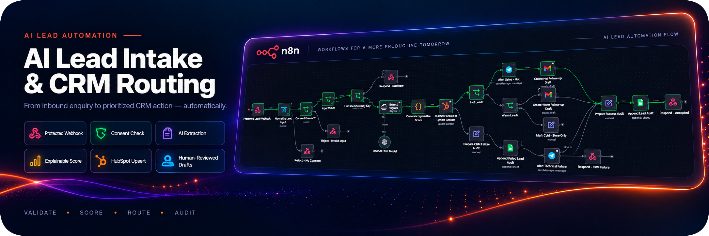
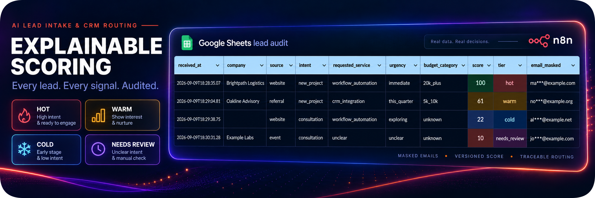
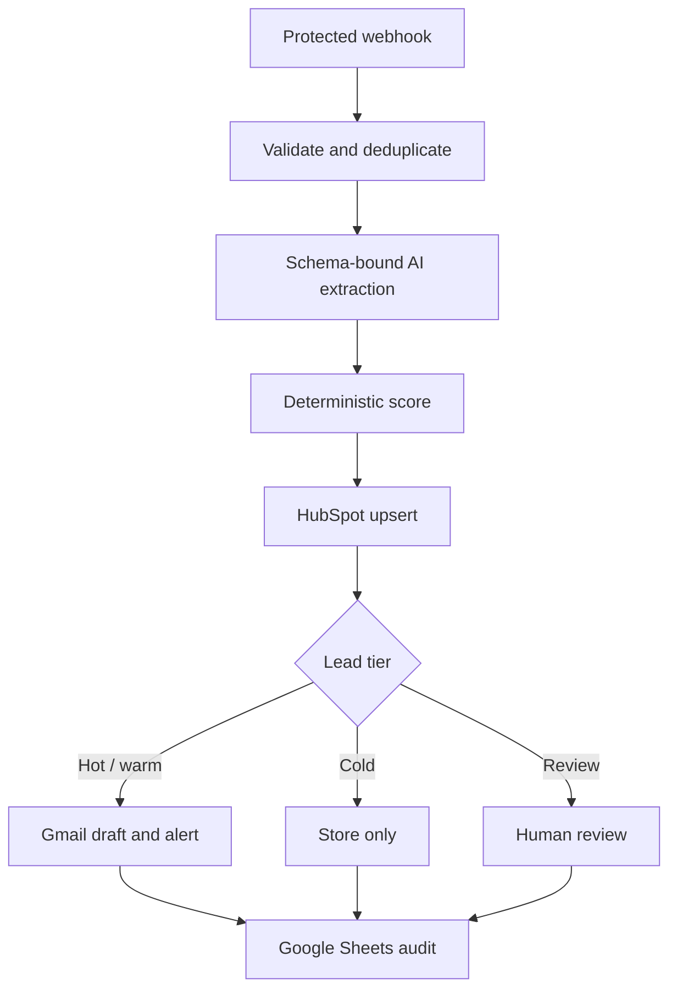
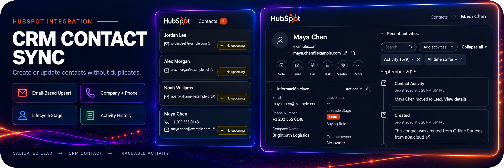
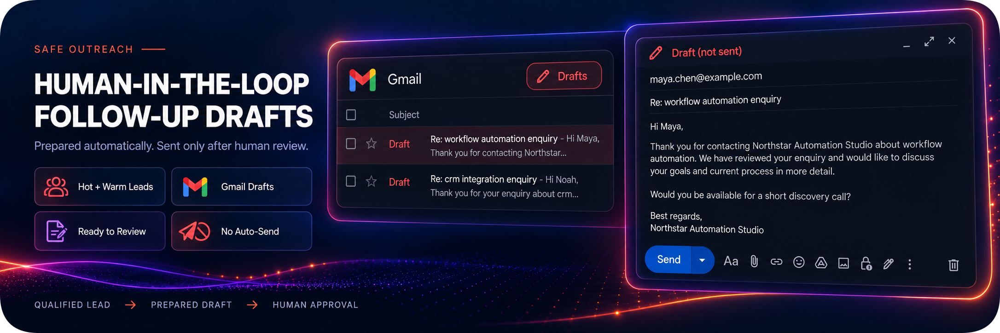
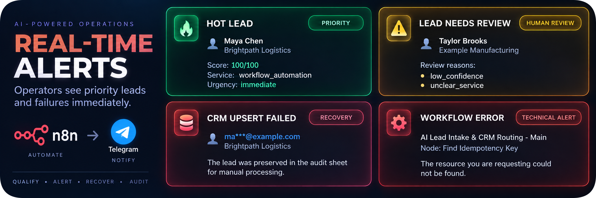

# AI Lead Intake & CRM Routing

> A production-minded n8n workflow that validates inbound B2B leads, extracts structured intent, applies explainable scoring, upserts HubSpot contacts, creates human-reviewed follow-up drafts, and preserves an audit trail.




## Business Problem

Inbound enquiries often arrive as free text. A sales manager must validate each submission, understand the requested service and timeline, decide its priority, create or update the CRM contact, prepare a response, and record what happened. The process is repetitive and can create duplicate contacts or lose leads when an integration fails.

## Solution

This workflow accepts a protected JSON webhook, rejects invalid or non-consensual input before any paid AI call, checks an idempotency key, and uses an n8n Information Extractor with a JSON Schema to extract business signals. A single Code node calculates a versioned 0–100 score. HubSpot's native **Create/Update a contact** operation prevents contact duplication by email.

The resulting tier drives bounded actions:

- `hot`: urgent Telegram alert and a Gmail draft;
- `warm`: Gmail draft for human review;
- `cold`: CRM and audit storage only;
- `needs_review`: human-review alert;
- CRM failure: durable audit record, technical alert, and HTTP 503 response.

No message is sent automatically to a lead.



## Architecture



## Key Features

- Header-authenticated webhook and explicit consent check.
- Input normalization and length limits before AI processing.
- Request idempotency checked before AI and CRM calls.
- Schema-bound extraction with enums, required fields, and confidence.
- Prompt-injection boundary: the lead message is treated as data, not instructions.
- Transparent, versioned scoring independent of the LLM.
- Native HubSpot contact create-or-update operation.
- Human-in-the-loop Gmail drafts; never automatic outreach.
- Separate paths for AI uncertainty, CRM failure, and unhandled workflow errors.
- Retries on OpenAI, HubSpot, Google Sheets, and error notifications.
- Masked email in the audit log and bounded error messages.
- Synthetic fixtures for reproducible demos.

## CRM Contact Sync

Validated leads are created or updated in HubSpot by email. Company and phone fields are mapped when provided, while the contact activity remains traceable in the CRM.



## Human-Reviewed Follow-up

Hot and warm leads receive prepared Gmail drafts. The workflow never sends outreach automatically, so a human can review and edit every response before sending.



## Tech Stack

- n8n Cloud or self-hosted n8n 2.37+
- OpenAI Chat Model through n8n's Responses API option
- HubSpot CRM
- Google Sheets
- Gmail
- Telegram

## Implementation References

The implementation follows the current official documentation for its external integrations:

- [n8n OpenAI node](https://docs.n8n.io/integrations/builtin/app-nodes/n8n-nodes-langchain.openai/) — OpenAI Node V2 and Responses API support;
- [n8n Information Extractor](https://docs.n8n.io/integrations/builtin/cluster-nodes/root-nodes/n8n-nodes-langchain.information-extractor/) — schema-defined extraction;
- [n8n HubSpot node](https://docs.n8n.io/integrations/builtin/app-nodes/n8n-nodes-base.hubspot/) — native contact search and create/update operations;
- [n8n Gmail drafts](https://docs.n8n.io/integrations/builtin/app-nodes/n8n-nodes-base.gmail/draft-operations/) — human-reviewed draft creation;
- [OpenAI Structured Outputs](https://developers.openai.com/api/docs/guides/structured-outputs/) — schema adherence and handling unrelated user input.

## Repository Structure

```text
.
├── workflows/              # Importable n8n workflows
├── schemas/                # AI output contract
├── prompts/                # Version-controlled extraction instructions
├── demo/                   # Synthetic requests and Sheets template
├── docs/                   # Setup, tests, scoring, security, and operations
└── scripts/                # Fixture generation and offline validation
```

## Quick Start

1. Create a Google Sheet from `demo/google-sheets-template.csv` and name its tab `Leads`.
2. Create the n8n variables `LEAD_AUDIT_SHEET_ID` and `LEAD_ALERT_CHAT_ID` before configuring the workflows.
3. Import `workflows/lead-routing-error.json`, connect Telegram, save, and activate it.
4. Import `workflows/lead-routing-main.json`.
5. Connect Header Auth, OpenAI, HubSpot, Google Sheets, Gmail, and Telegram credentials.
6. Confirm that all Google Sheets nodes retain the Document expression, the `Leads` sheet, and `Map Automatically`. Do not replace the Document expression in the nodes.
7. Confirm that the HubSpot node maps Company Name and Phone Number as described in `docs/setup.md`.
8. Select the error workflow in the main workflow settings.
9. Run the tests in `docs/test-cases.md` against the test URL.
10. Activate the main workflow only after all acceptance tests pass.

The monorepo runs this project's CI from `.github/workflows/02-validate-lead-routing.yml` at the repository root.

Full instructions: [`docs/setup.md`](docs/setup.md).

## Example Request

```bash
curl --request POST "https://YOUR_N8N_HOST/webhook/lead-intake" \
  --header "Content-Type: application/json" \
  --header "X-Lead-Token: REPLACE_WITH_SECRET" \
  --header "Idempotency-Key: demo-lead-001" \
  --data @demo/requests/lead-001.json
```

Example response:

```json
{
  "accepted": true,
  "status": "completed",
  "request_id": "12345",
  "tier": "hot",
  "score": 100
}
```

## Data Contract

Required input fields are `name`, `email`, `message`, `source`, `consent_to_contact`, and an idempotency key supplied either in `Idempotency-Key` or in the JSON body. `company`, `phone`, and `estimated_budget` are optional. The maximum normalized message length is 4,000 characters.

The AI output contract is stored in [`schemas/lead-extraction.schema.json`](schemas/lead-extraction.schema.json). The scoring policy is documented in [`docs/scoring.md`](docs/scoring.md).

## Reliability and Failure Handling

- Validation failure returns HTTP 400 without calling AI.
- Missing consent returns HTTP 422 without persisting the submission.
- Repeated idempotency keys return the existing outcome path without repeating paid or side-effecting actions.
- AI errors retry up to three times, then degrade to `needs_review`.
- HubSpot errors retry, preserve the lead in the failure audit, alert an operator, and return HTTP 503.
- Unhandled failures invoke the separate Error Workflow.
- The audit append is a critical operation. If it fails after retries, the workflow fails visibly rather than returning a false success.



Operational guidance is in [`docs/operations.md`](docs/operations.md).

## Security and Privacy

- No credentials, account IDs, chat IDs, or real contact data are included.
- The webhook uses an n8n Header Auth credential.
- The public demo fixtures use reserved example domains and fictional companies.
- The audit sheet receives a masked email, not the full address or message.
- The AI receives name, company, budget, source, and enquiry text, but not email or phone.
- The prompt forbids enrichment and treats the enquiry as untrusted content.
- Gmail creates drafts only; a human remains responsible for sending.

See [`docs/threat-model.md`](docs/threat-model.md) for trust boundaries and residual risks.

## Testing

Run the offline artifact validator:

```bash
python scripts/generate_demo_requests.py --check
python scripts/validate_artifacts.py
node scripts/test_scoring.mjs
```

To regenerate every synthetic request and the expected extraction examples deterministically:

```bash
python scripts/generate_demo_requests.py
```

Then execute the acceptance scenarios in [`docs/test-cases.md`](docs/test-cases.md). AI and external integrations cannot be fully verified offline; final acceptance requires the imported workflows to run against test accounts.

## Known Limitations / Roadmap

- Google Sheets is a lightweight audit store, not a high-throughput transactional database.
- Cross-execution idempotency depends on the audit sheet lookup and therefore inherits its availability and consistency limits.
- The email regex intentionally performs pragmatic syntax validation, not mailbox verification.
- The workflow synchronizes contacts only; deal creation and custom HubSpot properties are outside the current scope.
- The workflow has not been load-tested and has no queue or multi-tenant isolation.
- Notification-node failures currently continue so a secondary notification cannot lose the accepted lead; inspect executions for notification failures.
- Before production use, replace Google Sheets with a transactional store, add retention rules, define SLAs, run concurrency tests, restrict CORS origins, and add monitoring.

This repository is a production-oriented reference implementation, but deployment readiness still depends on the target environment, expected load, and operational controls.

## License

MIT — see [`LICENSE`](LICENSE).
