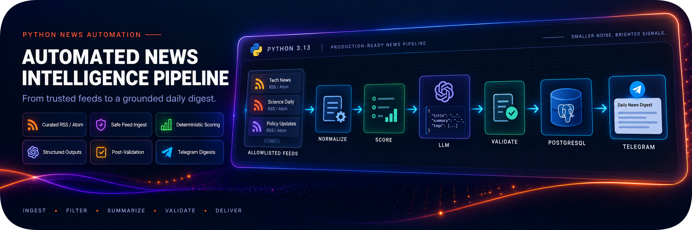
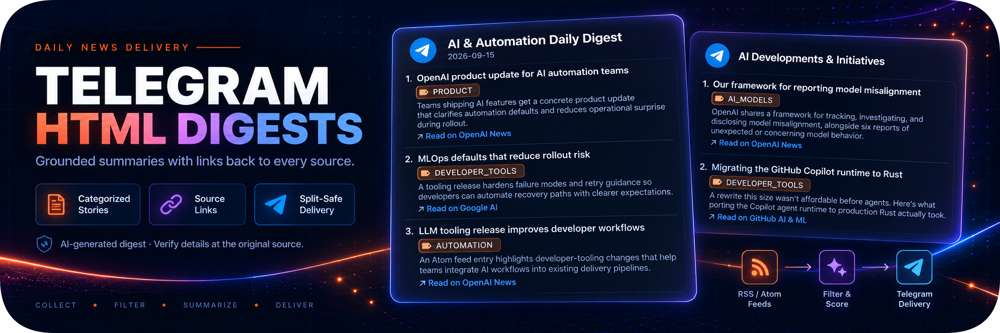
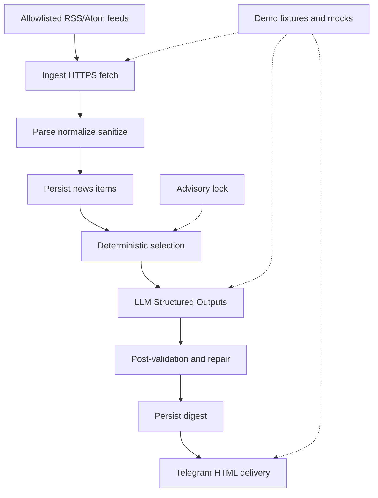

# Automated News Intelligence Pipeline



Production-minded Python service that collects curated RSS/Atom feeds, applies
deterministic filtering and scoring, produces a grounded LLM digest with
Structured Outputs, persists state in PostgreSQL, and delivers HTML digests to
Telegram.

> Portfolio-grade MVP: intentionally bounded, reproducible in demo mode, and
> explicit about trust boundaries and limitations.

## Business Problem

Product and AI/automation teams follow many publisher feeds. Manual triage is
slow, duplicates are common, and there is no consistent way to turn a noisy
stream into a short daily brief with provenance back to the original article.

A scrapey “read the whole web” crawler is the wrong tool here. What is needed is
a **bounded** pipeline over a trusted allowlist: collect safely, filter
deterministically, ask a model only for grounded selection and summaries, then
deliver something an operator can verify at the source.

## Solution

This repository is a layered Python application (domain / application /
infrastructure) with three entrypoints: CLI, APScheduler process, and a small
FastAPI ops API.

In **demo** mode the pipeline runs end-to-end without outbound feed HTTP or a
live OpenAI/Telegram account: local RSS fixtures, a mock LLM client, and a mock
Telegram client. In **live** mode it fetches allowlisted HTTPS feeds, calls the
OpenAI Responses API with Structured Outputs, and optionally delivers to
Telegram.

The LLM proposes digest items and summaries but does **not** make the final
acceptance decision alone. Local post-validation checks candidate grounding,
item counts, summary length, forbidden markup/URLs, and Telegram message
splitting. Feed and article URL policy (including exact host allowlisting) is
enforced outside the model.

## Demo Output



The generated digest contains categorized, grounded summaries with direct links
to the original publishers. Long digests are split into Telegram-safe parts
without breaking individual news items.

## Architecture



Concurrent runs are serialized with a PostgreSQL advisory lock. Unexpected
provider or delivery failures are mapped to typed error codes and persisted on
the pipeline run / digest records.

## Key Features

- Curated feed allowlist in `config/feeds.yaml` with DB seed;
- HTTPS-only feed fetches, pinned `allowed_host`, public DNS/IP checks, no
  redirects, size and timeout limits;
- Conditional GET (`ETag` / `If-Modified-Since`) and concurrency caps;
- Article `canonical_url` host must exactly match the source `allowed_host`;
- HTML sanitization (`nh3`), title normalization, and content hashing for
  deduplication;
- Deterministic pre-filter, keyword/freshness/source scoring, and per-source
  diversity caps;
- Opaque LLM candidate ids (`c_01` …) so the model cannot invent database UUIDs;
- OpenAI Responses Structured Outputs with one repair pass on post-validation
  failure;
- Summaries constrained to 80–280 characters; URLs and Telegram/HTML markup
  rejected in summaries;
- Telegram HTML digests with `html.escape` on dynamic fields and disabled link
  previews;
- Per-part delivery attempts, rate-limit retry, and `retry-delivery` CLI;
- FastAPI `/health/live` and `/health/ready`; `/status` requires
  `X-Admin-Api-Key`;
- Demo mode for local smoke without paid APIs;
- Docker Compose services with non-root app images, read-only filesystem, and
  dropped capabilities;
- Unit and Postgres integration tests (testcontainers).

## Demo vs Live

| Mode | Feeds | LLM | Telegram |
| --- | --- | --- | --- |
| `APP_MODE=demo` | Local fixtures under `demo/feeds/` | Mock client | Mock / disabled |
| `APP_MODE=live` | Real HTTPS allowlisted URLs | OpenAI Responses API | Optional real bot |

Demo still enforces feed URL policy and article host checks against configured
sources. It does not weaken SSRF controls.

## Tech Stack

- Python 3.13
- FastAPI, Pydantic Settings
- SQLAlchemy 2 async + asyncpg, Alembic
- APScheduler
- httpx, feedparser, nh3
- OpenAI Python SDK (Responses / Structured Outputs)
- aiogram 3
- Docker Compose, pytest, testcontainers, Ruff, mypy, Bandit, pip-audit

## Repository Structure

```text
.
├── app/                      # Domain, application, infrastructure, API, CLI, scheduler
├── config/                   # feeds.yaml, topic_profile.yaml
├── demo/feeds/               # Demo RSS fixtures with relative pubDates
├── tests/                    # Unit and integration suites
├── alembic/                  # Migrations
├── docker-compose.yml
├── docker-compose.dev.yml    # Publishes Postgres on 127.0.0.1:5432
├── .env.example
├── CHANGELOG.md
├── LICENSE
├── SECURITY.md
└── README.md
```

## Requirements

- Docker Desktop (or another engine) for Compose-based Postgres and services;
- Python 3.13 for host-side CLI and tests;
- For **live** digests: `OPENAI_API_KEY`;
- For **live** Telegram delivery: bot token, chat id, and `TELEGRAM_ENABLED=true`;
- `ADMIN_API_KEY` when required by settings (production / live+manual) to call
  `/status`.

## Quick Start

1. Copy `.env.example` to `.env` and set Postgres credentials. For a first run
   keep `APP_MODE=demo`, `TELEGRAM_ENABLED=false`, and `MANUAL_RUN_ENABLED=true`.
2. Start Postgres, migrations, API, and scheduler with the dev override so the
   database is reachable from the host on `127.0.0.1:5432`:

```bash
docker compose -f docker-compose.yml -f docker-compose.dev.yml up --build
```

3. Create a virtualenv, install the package, seed sources, and run a demo digest:

```bash
python -m venv .venv
# Windows: .\.venv\Scripts\activate
# Unix: source .venv/bin/activate
pip install -e ".[dev]"
python -m app.cli seed-sources
python -m app.cli run-digest --dry-run
python -m app.cli run-digest
```

Expect `status=success` or `partial_success` with a `digest_id` when enough
candidates exist. With Telegram disabled, digests remain in the database
(typically `generated`, not `sent`).

4. Check health (no auth):

- `GET http://127.0.0.1:8000/health/live`
- `GET http://127.0.0.1:8000/health/ready`

`GET /status` requires header `X-Admin-Api-Key` matching `ADMIN_API_KEY` in the
API process. `/digests/latest` stays unavailable unless
`EXPOSE_DEMO_ENDPOINTS=true`.

Useful Make targets: `make test`, `make test-integration`, `make lint`,
`make typecheck`, `make security`, `make migrate`, `make db-check`, `make seed`.

## Digest Data Contract

The model returns:

- `digest_title`;
- one to seven items, each with opaque `candidate_id` (`c_NN`);
- `summary` (80–280 characters);
- `tag` from a fixed enum (for example `PRODUCT`, `AUTOMATION`, `SECURITY`);
- `relevance_score` in `[0, 1]`;
- `selection_reason`.

The schema lives in application code (`DigestModelOutput`) and is enforced by
Structured Outputs. JSON Schema compliance is not enough: post-validation also
requires that every `candidate_id` maps to a current `CANDIDATE` news item,
summaries contain no URLs or HTML/Telegram markup, and the rendered digest can
be split under Telegram’s 4096-character limit.

## Feed Ethics

This project is a **curated RSS/Atom subscriber**, not an open-web crawler:

- only publisher feed URLs from an explicit allowlist are fetched;
- requests use an identifiable `User-Agent`, timeouts, size caps, and Conditional
  GET;
- article HTML pages are not scraped;
- robots.txt crawling of the open web is out of scope for a fixed allowlist of
  feed endpoints.

## Error Handling and Reliability

- Per-source feed failures can yield `partial_success` when enough candidates
  remain for a digest;
- too few candidates yield `no_content` (a valid outcome, not necessarily a bug);
- an advisory lock miss yields `skipped_locked`;
- invalid LLM output triggers one repair pass; persistent failure does not mark
  candidates `USED`;
- Telegram `429` retries with backoff; permanent rejection or exhausted retries
  mark the digest `FAILED` while preserving prior successful parts when possible;
- structured logging redacts credential-like fields.

## Security and Privacy

- No API keys, bot tokens, or real chat ids belong in git; use `.env` locally;
- feed SSRF controls: host pin, public IPs only, connect-by-IP with SNI, no
  redirects, `trust_env=false`;
- article links off the allowlisted host are skipped at normalize time;
- Telegram dynamic fields are HTML-escaped; link previews are disabled;
- SQL access goes through SQLAlchemy with bound parameters;
- `/status` is authenticated; health endpoints stay public for probes;
- Compose app services run as non-root with read-only root filesystem and
  `cap_drop: ALL`.

See [SECURITY.md](SECURITY.md) for reporting guidance.

## Testing

```bash
make lint
make typecheck
make test
make test-integration
make security
```

Integration tests use Postgres via testcontainers.

Demo feed fixtures under `demo/feeds/` keep relative publication dates inside the
configured age window so demo runs stay reproducible.

## Known Limitations / Roadmap

### MVP limitations

- exact article host match only (no automatic eTLD+1 expansion);
- single-operator / single-deployment assumptions; no multi-tenant isolation;
- Postgres is the system of record, not a product UI or newsreader client;
- scheduler is a single process with a daily cron (accelerated local tests are
  manual env overrides);
- demo fixtures cover the happy path; live feed quality depends on publishers;
- no guarantee of editorial accuracy—operators must verify at the original URL;
- `/digests/latest` is a gated demo surface, not a public content API.

### Possible roadmap

- richer ops UI or digest archive browser;
- optional registrable-domain allowlisting for article links;
- metrics and alerting beyond logs;
- broader provider abstraction for LLM and messengers;
- retention jobs and clearer multi-environment deploy profiles.

## License

MIT. See [LICENSE](LICENSE).

## Disclaimer

This project demonstrates automation and backend engineering patterns for a
bounded news-digest pipeline. It is not a news agency, compliance product, or
investment advice service. Always verify details at the original publisher
before acting on a digest item.

## Documentation References

- [OpenAI Structured Outputs](https://platform.openai.com/docs/guides/structured-outputs)
- [OpenAI Responses API](https://platform.openai.com/docs/api-reference/responses)
- [FastAPI](https://fastapi.tiangolo.com/)
- [aiogram HTML formatting](https://docs.aiogram.dev/en/latest/api/enums.html#aiogram.enums.ParseMode)
- [PostgreSQL advisory locks](https://www.postgresql.org/docs/current/explicit-locking.html#ADVISORY-LOCKS)
